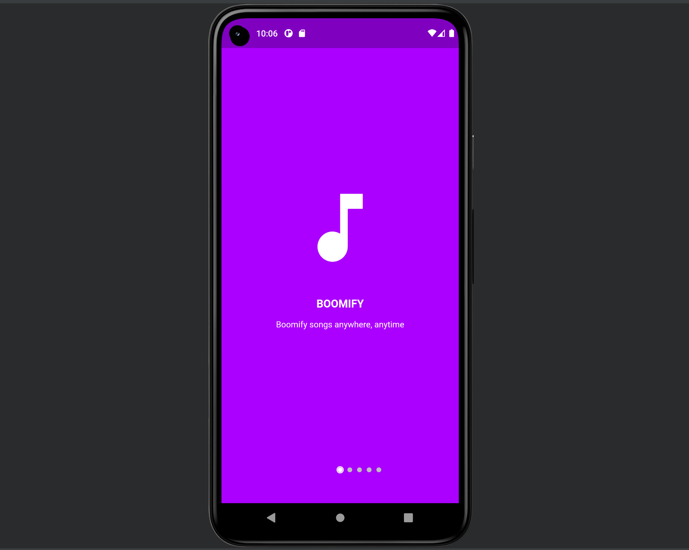
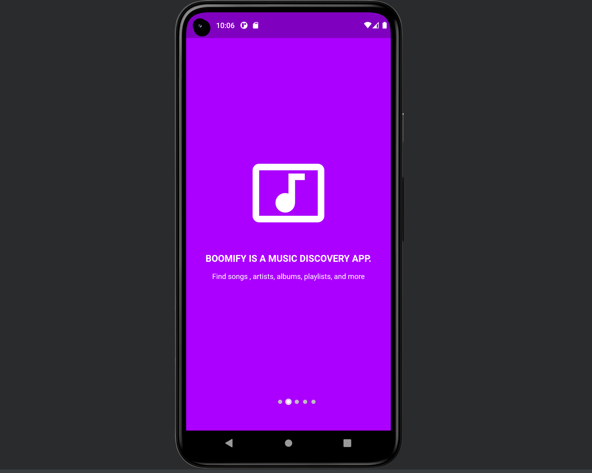
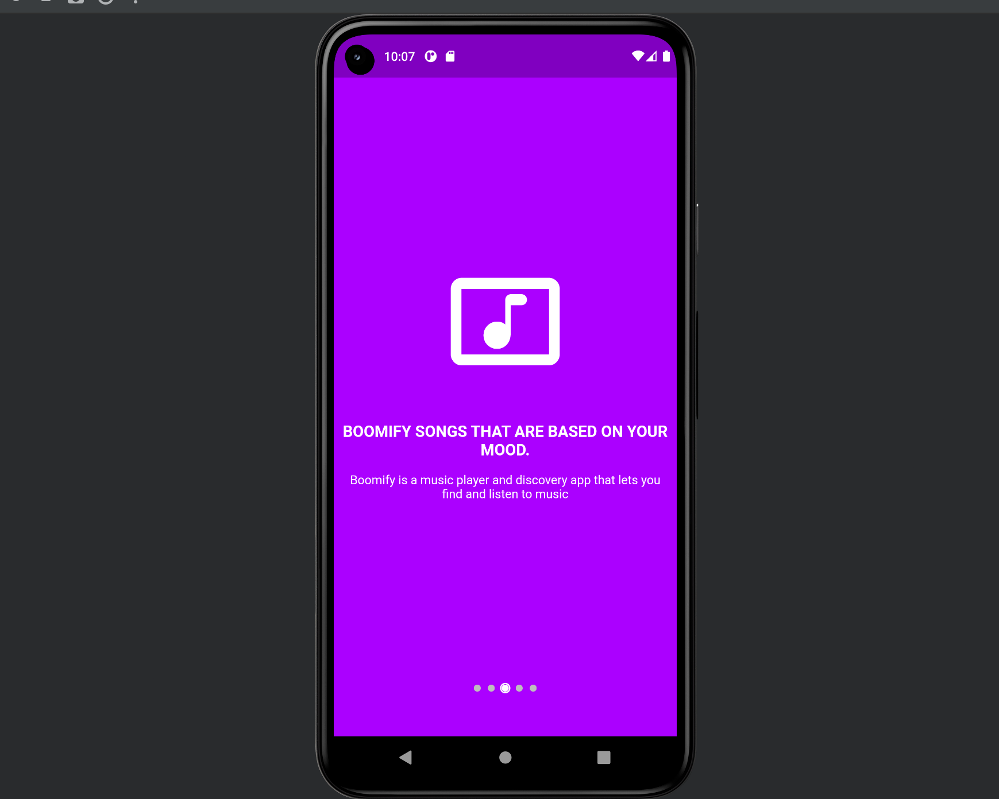
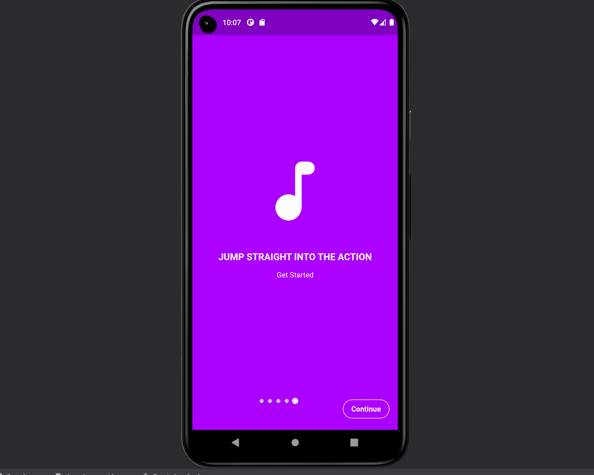
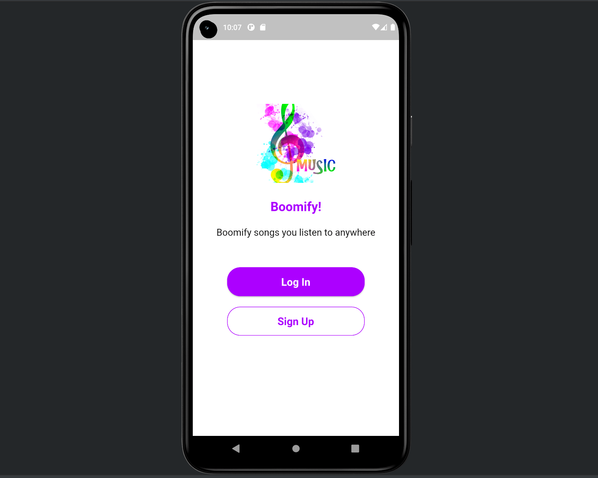
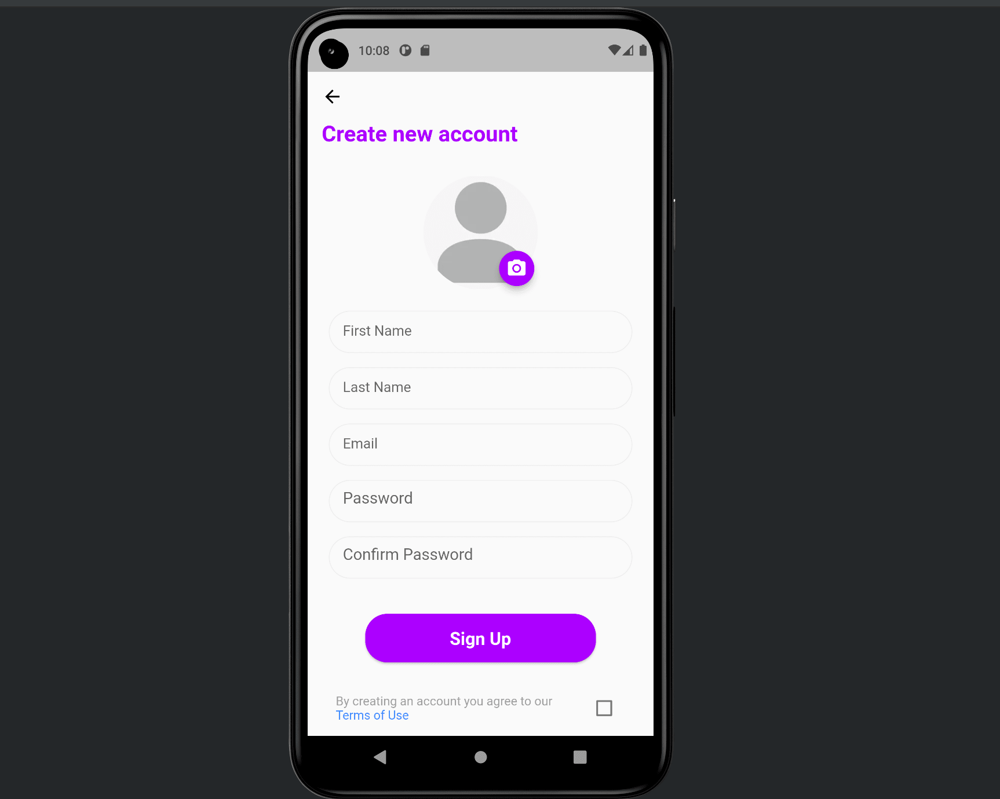
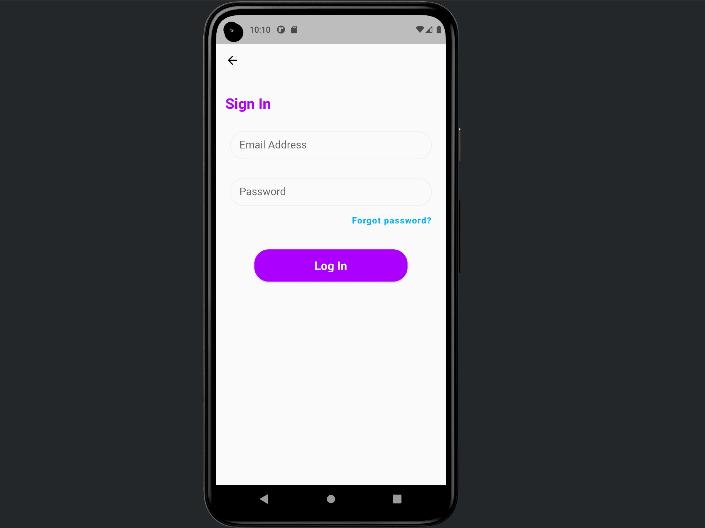

# Booomify ~ *Boomify songs anywhere , anytime.*

## What is Booomify?

Boomify is an app that can identify music and TV shows by listening to a short sample of their audio.And it can also play music and TV shows from your phone.

## Boomify OnBoarding   
   

## Boomify Features

Boomify is a fully functional app that provides Flutter developers with a coded template for their mobile app projects.It has the following features:
* Identify music and TV shows by listening to a short sample of their audio.
* Play music and TV shows from your phone.
* Search for music and TV shows.
* Create and manage playlists.
* Share music and TV shows with friends.
* Download music and TV shows to your phone for offline listening.
* Login with Google, or email.
* Create a profile with a username, profile picture, and bio.
* Firebase Authentication.
* Cross-platform (Android and iOS).
* Clean and well-structured code.
* Easy to customize and extend.
* Well documented.
* And much more...

## Fully Functional Screens

# Authentication Screens
On authentication screens, users can login with Google, or email. They can also create a new account with email and password. The app uses Firebase Authentication to handle user authentication and flutter_bloc to manage the state of the authentication screens.
* Login and Register Screens
  ## Login and Register Screen
    
* Sign Up
  ## Sign Up Screen
    

* Login Screen
  ## Login Screen
    

## Other Additional Advantages
* Beautiful UI
* Modularized Code
* Loading State
* Error Handling
## How to use?

1. Download the app from [here](com.booomify.booomify.apk)
2. Install the app

## How to contribute?

1. Fork the repo
2. Make changes
3. Create a pull request
4. Wait for review
5. Merge
6. Celebrate

## Credits
    
- [Flutter](https://flutter.dev/)
- [Spotify](https://developer.spotify.com/)
- [Firebase](https://firebase.google.com/)

## Contributors

- [Joakim Bwire](https://github.com/Joakim-animate90)~Software Engineer and a great Chess Player.

## License

MIT LICENSE

